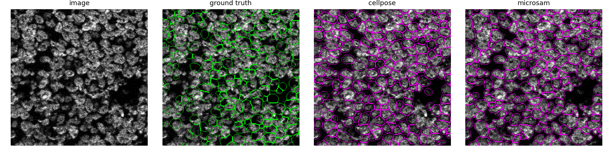

# cajal

**Which cell-segmentation foundation model works best on multiplexed tissue, and how much does fine-tuning help?**

A reproducible benchmark of three pretrained segmentation models (Cellpose-SAM, μSAM, StarDist)
on TissueNet, run end to end on Purdue's Gilbreth HPC cluster, with correct instance-level metrics,
confidence intervals, honest failure analysis, and a measured fine-tuning gain.

> Named after Santiago Ramón y Cajal, who hand-drew and segmented cells from stained tissue under a microscope.

## Results

TissueNet v1.1 test split, per-image (macro) averaging, bootstrap 95% confidence intervals.
Higher is better; **bold** is best in column.

### Whole-cell

| model | F1@0.5 | F1@0.75 | AJI+ | boundary-F1 | Dice |
|---|---|---|---|---|---|
| **Cellpose-SAM** | **0.844 ±.013** | **0.591** | **0.718** | **0.869** | **0.902** |
| μSAM | 0.736 ±.018 | 0.412 | 0.597 | 0.740 | 0.808 |

### Nuclear

| model | F1@0.5 | F1@0.75 | AJI+ | boundary-F1 | Dice |
|---|---|---|---|---|---|
| **Cellpose-SAM** | **0.841 ±.017** | 0.530 | **0.710** | 0.895 | 0.871 |
| μSAM | 0.810 ±.015 | **0.601** | 0.702 | **0.907** | **0.892** |
| StarDist | 0.766 ±.023 | 0.464 | 0.633 | 0.848 | 0.844 |

**Read it this way.** Cellpose-SAM is the most reliable out-of-the-box choice, and its whole-cell
lead over μSAM (0.844 vs 0.736) is far larger than the confidence intervals, so it is a real
difference. On nuclei the three models are close: μSAM draws the tightest boundaries, and StarDist
is a solid lightweight specialist (StarDist runs at N=148; see Limitations).

### Fine-tuning Cellpose-SAM (whole-cell)

Fine-tuning on TissueNet's own labels raises whole-cell F1@0.5 from **0.844** (zero-shot) to
**0.859** with 200 images (+1.5 pts) and **0.865** with the full 2,580-image set (**+2.1 pts**).
More labeled data buys more accuracy.

### A finding worth highlighting

μSAM first scored 0.51 on whole cells. The cause was not the model but the input: averaging the two
image channels into grayscale erased the cell-membrane edges the model relies on. Feeding it an RGB
image of `[membrane, nuclear, membrane]` recovered it to 0.74. Input adaptation can matter as much as
model choice when applying RGB-pretrained foundation models to multiplexed data.



*Nuclear task: the raw image, then cell outlines from ground truth (green) and each model (magenta).
A pitch sheet with more examples is in [`results/showcase.html`](results/showcase.html).*

## Why the numbers can be trusted

- **AJI+** reimplemented as an O(image) contingency table, unit-tested to be numerically identical to
  the reference HoVer-Net implementation and about 28x faster on dense tissue.
- Hungarian 1-to-1 instance matching, per-image averaging stated explicitly, bootstrap 95% confidence
  intervals on every metric, and a paired-bootstrap test for the fine-tuning delta.
- One-command reproducible: pinned conda environments, seeded runs, scripted cluster jobs, unit tests.

## Honest limitations

- **StarDist** runs on a smaller sample (N=148). Its TensorFlow build crashes beyond that on this
  cluster, on both GPU and CPU, so treat its row as approximate.
- The **+2.1 full-data fine-tune** number is a single short run: a solid signal, not yet with error bars.
- Everything is measured on **TissueNet**, so it is an honest answer for TissueNet-like tissue.
- These are off-the-shelf models. This is a rigorous, reproducible comparison, not a new architecture.

## Reproduce

Full cluster recipe (environment build, weight pre-caching, scoring) is in [`CLAUDE.md`](CLAUDE.md). In short:

```bash
export DEEPCELL_ACCESS_TOKEN=...              # free token from users.deepcell.org
python data/download_tissuenet.py             # download + md5-verify + extract TissueNet v1.1
bash scripts/gilbreth/build_envs.sh           # + build_envs2.sh: three pinned conda envs
# inference (one model/task per Slurm job; weights pre-cached for offline compute nodes):
sbatch --export=ALL,ENV=torch-cell,MODEL=cellpose,TASK=wholecell,SAMPLE=300 slurm/benchmark.sbatch
# score every mask, build the tables (with CIs) and figures:
sbatch slurm/finalize.sbatch
# fine-tune with a validation-selected learning rate:
sbatch --export=ALL,LR=1e-5,EPOCHS=20,MAXN=200 slurm/finetune.sbatch
python -m src.viz.build_showcase              # -> results/showcase.html
```

Metrics are unit-tested locally with no GPU or dataset needed: `python tests/test_metrics.py`.

## Repo layout

```
data/         download_tissuenet.py, loader.py (percentile normalization + seeded sampling)
src/models/   cellpose / microsam / stardist wrappers (one segment() contract)
src/eval/     metrics.py (AJI+/PQ/F1/boundary-F1/Dice + bootstrap CIs), run_benchmark.py
src/train/    finetune.py, finetune_study.py (val-based LR selection)
src/viz/      plots.py (overlays), build_showcase.py / build_dashboard.py (HTML)
third_party/  vendored HoVer-Net AJI (pinned commit)
slurm/        Slurm job scripts;  scripts/gilbreth/  cluster helpers
tests/        unit tests for metrics + loader
results/      committed tables, figures, and HTML report sheets
```

## Reports

- [`REPORT.md`](REPORT.md): a plain-English summary of the study and findings.
- [`results/showcase.html`](results/showcase.html): one self-contained page, results plus example pictures.
- [`results/benchmark_tables.md`](results/benchmark_tables.md) and
  [`results/finetune_delta.md`](results/finetune_delta.md): the raw numbers.

## License and data

- Cellpose `cpsam` weights are **CC-BY-NC** (research use, not commercial).
- **TissueNet** is non-commercial academic. The raw dataset is not redistributed here; only a few small
  example overlays are shown for illustration.
